# Website Structure Diagram

```mermaid
graph TD
    A[Website] --> B[Header/Navigation]
    A --> C[Main Content]
    A --> D[Footer]
    
    B --> B1[Logo]
    B --> B2[Desktop Menu]
    B --> B3[Mobile Hamburger]
    B --> B4[Send Message Button]
    
    B2 --> B2A[Home]
    B2 --> B2B[About]
    B2 --> B2C[Recipes]
    B2 --> B2D[Articles]
    B2 --> B2E[Contact]
    
    B2C --> B2C1[Healthy Recipes]
    B2C --> B2C2[Snacks Recipes]
    B2C --> B2C3[Vegetarian Recipes]
    B2C --> B2C4[Chicken Recipes]
    B2C --> B2C5[Meat Recipes]
    B2C --> B2C6[Seafood Recipes]
    B2C --> B2C7[Rice Recipes]
    
    B3 --> B3A[Mobile Drawer]
    B3A --> B3A1[Home]
    B3A --> B3A2[About]
    B3A --> B3A3[Recipes]
    B3A --> B3A4[Articles]
    B3A --> B3A5[Contact]
    B3A --> B3A6[Send Message]
    
    B3A3 --> B3A3A[Healthy Recipes]
    B3A3 --> B3A3B[Snacks Recipes]
    B3A3 --> B3A3C[Vegetarian Recipes]
    B3A3 --> B3A3D[Chicken Recipes]
    B3A3 --> B3A3E[Meat Recipes]
    B3A3 --> B3A3F[Seafood Recipes]
    B3A3 --> B3A3G[Rice Recipes]
    
    D --> D1[Trending Links]
    D --> D2[Social Share]
    D --> D3[Legal]
    
    D1 --> D1A[Health]
    D1 --> D1B[Beauty]
    D1 --> D1C[Veg Recipes]
    D1 --> D1D[Summer Special]
    D1 --> D1E[Indian Recipes]
    
    D2 --> D2A[Social Media Links]
    
    D3 --> D3A[Privacy Policy]
    D3 --> D3B[About Us]
    D3 --> D3C[Feedback]
    D3 --> D3D[Author]
    D3 --> D3E[DNPA Code of Ethics]
    D3 --> D3F[Copyright]
```

# Implementation Phases

## Phase 1: Consistent Page Structure
- Update recipes.html and contact.html to match the header/footer structure of index.html
- Ensure consistent navigation across all pages
- Verify "Send Message" button placement

## Phase 2: Navigation Components
- Enhance desktop dropdown menu for Recipes with all sub-items
- Implement smooth animations for dropdown menu
- Create mobile-friendly drawer menu with all navigation items
- Implement smooth animations for drawer menu
- Ensure mobile menu closes when clicking overlay or links

## Phase 3: Comprehensive Footer
- Design footer with Trending Links section
- Add Social Share section
- Add Legal section
- Ensure footer consistency across all pages

## Phase 4: Articles Page Enhancement
- Improve search functionality
- Ensure proper article display layout
- Verify publication timestamps
- Ensure effective search filtering

## Phase 5: Visual Consistency and Responsiveness
- Create unified CSS structure
- Implement responsive design
- Ensure smooth animations
- Verify professional aesthetic